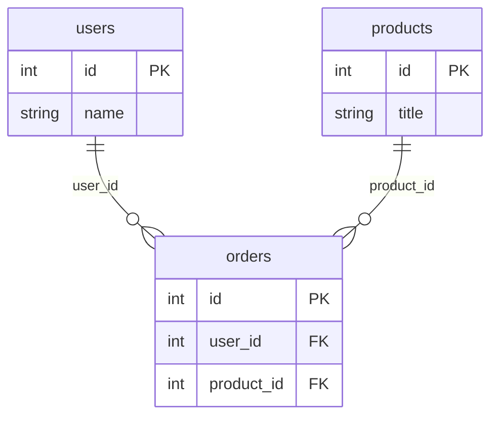

# feat: ERD / Relationship Diagram

## Overview

Add an ERD (Entity-Relationship Diagram) view that renders foreign key relationships between tables as an interactive graph. Users can open the diagram from the schema browser to visualize how tables in a schema relate to each other — ideal for onboarding to an unfamiliar database.

## Problem Statement / Motivation

The schema browser shows FK info per-column (🔗 icon with `→ table.column` tooltip at `SchemaNode.svelte:78`), but there's no way to see the whole picture at once. Developers joining a new project must mentally reconstruct the relational model by scanning individual tables. An ERD view solves this by giving a spatial, at-a-glance view of the entire schema's relationships.

## Proposed Solution

Add a new tab view type (`erdView`) following the established pattern used by `tableBrowse` and `schemaDdl`. When the user opens the ERD for a connection/schema, a new tab renders an interactive SVG graph where:

- Each table is a node showing its column names and types
- FK relationships are directed edges from the FK column to the referenced table/column
- The graph supports pan, zoom, and optionally drag-to-reposition nodes

### Graph Rendering Library

Use **`@xyflow/svelte`** (Svelte Flow) for node/edge layout, pan/zoom, and drag behavior. This avoids reimplementing graph layout from scratch while staying lightweight (tree-shaken). Plain SVG is the fallback if the dependency is undesirable — a simple force-directed or grid layout using native `<svg>` is viable given the scale of typical schemas.

### Data Source

FK data already lives in `SchemaColumnInfo.foreignTable` / `SchemaColumnInfo.foreignColumn` (`src/lib/types.ts:241`). The schema store caches columns per table as they are expanded. For the ERD, all tables' columns need to be loaded at once. Two options:

- **Option A (preferred):** Add a new Rust command `get_schema_foreign_keys` that returns all FK edges for a schema in a single query per DB type — fast and atomic.
- **Option B (simpler):** Reuse `get_columns` for each table in parallel on the frontend, populating the existing `schema.columns` cache, then derive edges from it.

Option A is cleaner for large schemas and avoids N+1 Tauri calls.

## Technical Considerations

- **Architecture:** New `ErdViewState` type added to `QueryTab` discriminated union; `openErd()` method on the `tabs` store mirrors the existing `openSchemaDdl()` pattern.
- **No FK concept in ClickHouse:** The ERD should gracefully show an empty edge set for ClickHouse connections without erroring.
- **Circular FK chains:** Graph traversal must handle cycles (self-referential tables, mutual FKs). Svelte Flow handles rendering cycles natively; the data model just needs to be a plain edge list.
- **Large schemas:** Some production databases have 100+ tables. The graph should be zoomable and the initial layout should use a hierarchical or force-directed algorithm so nodes don't overlap. Svelte Flow's dagre/elk layout plugins handle this.
- **Performance:** Column fetching via `get_schema_foreign_keys` should be a single round-trip. The store can cache the result keyed by `(connectionId, schema)`.
- **Theming:** Use existing CSS custom properties (`--color-bg`, `--color-accent`, `--color-border`, `--color-text`) from `src/app.css` for node/edge colors so the diagram inherits the app theme automatically.

## System-Wide Impact

- **Interaction graph:** New "Open ERD" action in `SchemaBrowser.svelte` → dispatches `openErd(connectionId, schema)` → `tabs.svelte.ts` creates a new tab → `TabbedEditor.svelte` renders `<ErdDiagram>` → `ErdDiagram` calls `invoke('get_schema_foreign_keys')` → Rust command queries DB → returns `Vec<ForeignKeyEdge>` → Svelte Flow renders nodes/edges.
- **State lifecycle:** ERD tab state is ephemeral (tab-scoped, not persisted). No DB writes. The column cache in `schema.svelte.ts` may be populated as a side effect if Option B is chosen.
- **API surface parity:** No existing ERD surface — this is net-new. The `get_schema_foreign_keys` command will be the sole new Tauri command.

## Acceptance Criteria

- [ ] "Open ERD" entry point is accessible from the schema browser (button in `SchemaBrowser.svelte` header or context menu on schema node)
- [ ] Clicking "Open ERD" opens a new tab with `type: 'erdView'`
- [ ] All tables in the selected schema are rendered as nodes
- [ ] FK relationships render as directed edges with label showing `fk_column → ref_table.ref_column`
- [ ] Graph supports pan and zoom
- [ ] Diagram respects the app's CSS theme (dark/light)
- [ ] ClickHouse connections show tables with no edges (no crash)
- [ ] Schemas with circular FK references render without infinite loops
- [ ] Large schemas (50+ tables) render within 2 seconds

## Dependencies & Risks

| Dependency | Notes |
|---|---|
| `@xyflow/svelte` | New npm dependency; ~150 KB gzipped. Needs `package.json` addition. |
| Rust `get_schema_foreign_keys` | New Tauri command across 5 DB types. MSSQL/Oracle paths are the most complex. |
| `ErdViewState` type | Requires touching `src/lib/types.ts`, `src/lib/stores/tabs.svelte.ts`, `src/lib/components/TabbedEditor.svelte` |

**Risks:**
- Svelte Flow may conflict with Svelte 5 runes (check compatibility — `@xyflow/svelte` v0.x targets Svelte 4/5). If incompatible, fall back to plain SVG.
- Oracle FK queries are complex (see `core/src/db/oracle.rs:218`); bulk-schema variant may require extra testing.

## Implementation Steps

### Phase 1: Data Layer

1. Add `ForeignKeyEdge` struct to `core/src/models.rs` (fields: `from_table`, `from_column`, `to_table`, `to_column`)
2. Add `get_schema_foreign_keys(connection_id, schema)` Tauri command in `src-tauri/src/commands.rs`
3. Implement per-DB SQL in `core/src/db/any.rs` (Postgres, MySQL, SQLite), `core/src/db/mssql.rs`, `core/src/db/oracle.rs`
4. Register command in `src-tauri/src/lib.rs`
5. Add TypeScript type `ForeignKeyEdge` to `src/lib/types.ts`

### Phase 2: State & Navigation

6. Add `ErdViewState` interface and `erdView?: ErdViewState` to `QueryTab` in `src/lib/types.ts`
7. Add `openErd(connectionId: string, schema?: string)` to `src/lib/stores/tabs.svelte.ts`
8. Add "Open ERD" button to `src/lib/components/SchemaBrowser.svelte`

### Phase 3: Diagram Component

9. Install `@xyflow/svelte` (verify Svelte 5 compatibility first)
10. Create `src/lib/components/ErdDiagram.svelte` — fetches FK edges, maps to Svelte Flow `nodes`/`edges`, renders `<SvelteFlow>`
11. Add `{:else if activeQueryTab.erdView}` branch in `src/lib/components/TabbedEditor.svelte`

### Phase 4: Polish

12. Style nodes using CSS custom properties; match app theme
13. Add dagre/elk layout plugin for automatic node positioning
14. Handle ClickHouse (empty edges), cycles, and large-schema performance

## Sources & References

### Internal References

- FK type definition (TS): `src/lib/types.ts:241–251`
- FK query — Postgres: `core/src/db/any.rs:634–693`
- FK query — MySQL: `core/src/db/any.rs:695–755`
- FK query — SQLite: `core/src/db/any.rs:757–795`
- FK query — MSSQL: `core/src/db/mssql.rs:201–318`
- FK query — Oracle: `core/src/db/oracle.rs:218–349`
- Tauri `get_columns` command: `src-tauri/src/commands.rs:1690–1697`
- Schema store (column cache): `src/lib/stores/schema.svelte.ts`
- SchemaNode FK icon: `src/lib/components/SchemaNode.svelte:78–82`
- Tab state model: `src/lib/stores/tabs.svelte.ts:99–200`
- View dispatch: `src/lib/components/TabbedEditor.svelte:96–152`
- CSS design tokens: `src/app.css:1–36`
- Tauri command registration: `src-tauri/src/lib.rs:17–79`

### Example Mermaid ERD (Illustrative)

