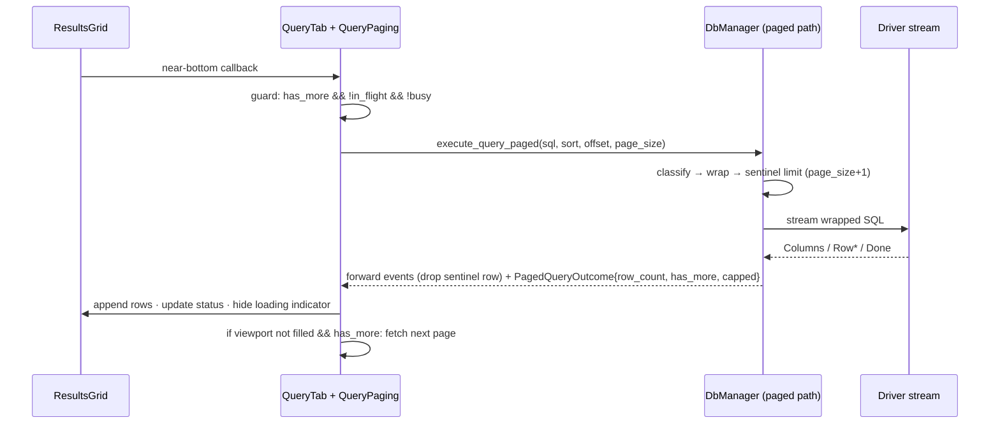
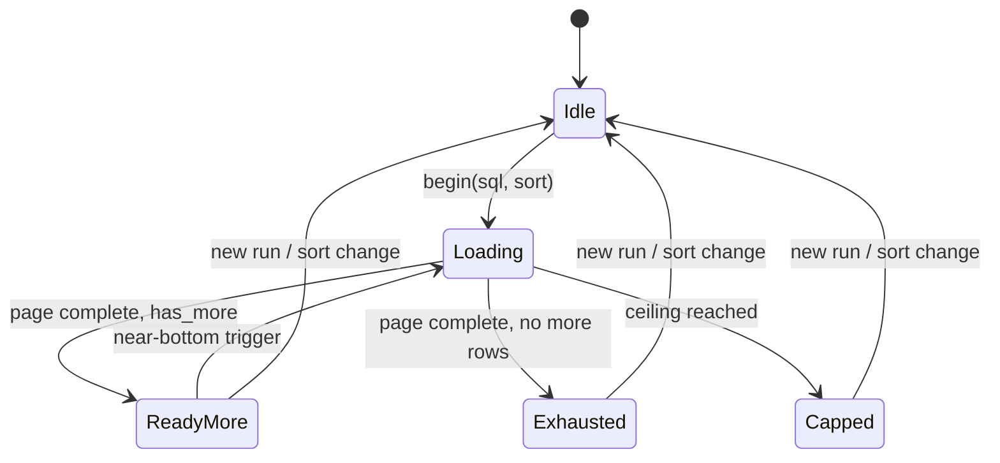

# GTK Grid Scroll Auto-Load with Engine Pagination - Plan

## Goal Capsule

- **Objective:** When the user scrolls near the bottom of a results grid in the GTK app, automatically fetch and append the next chunk of rows — in the query tab (backed by new engine-side pagination) and in the schema browse tab (trigger swap only).
- **Authority hierarchy:** the origin requirements doc's product decisions govern behavior; this plan's KTDs govern implementation approach; existing repo conventions (workspace lints, async patterns, GTK parity conventions) govern code shape.
- **Stop conditions:** a change that alters SQL semantics of user queries; any required change to Tauri/TUI/front-end contracts (the engine additions must stay purely additive); unresolved dialect behavior that can't fall back safely — surface, don't guess.
- **Execution profile:** four units; U1 and U2 are independent and may run in parallel, U3 depends on both, U4 depends on U2 only. Single-PR friendly.
- **Tail ownership:** the implementer runs the Verification Contract gates, satisfies per-unit test scenarios, and removes abandoned-approach code before declaring done.

---

## Product Contract

### Summary

The GTK results grids gains scroll-driven loading: scrolling near the bottom of the query tab or the schema browse tab automatically fetches and appends the next chunk of rows. The query tab is backed by new engine-side pagination that transparently wraps ad-hoc SELECTs for paged execution and server-side sorting, with a 50,000-row ceiling and a visible limit message.

### Problem Frame

The GTK query tab today streams ad-hoc query results in a single fetch. Every driver quietly suppresses row events past 1,000 (`max_rows = 1000` in each `core/src/db/*` driver), so large results appear truncated with no recourse, and most drivers still transfer the full result just to count it. The April requirements doc settled the product direction for this — auto-fetch on scroll with transparent pagination wrapping and a higher safety ceiling — but the Svelte-targeted implementation plan built on it was never executed, and the GTK app has since become the active desktop frontend. The schema browse tab already paginates server-side but through a manual "Load more" button, which the same product direction retires.

(see origin: docs/brainstorms/2026-04-13-unified-grid-infinite-scroll-requirements.md)

### Requirements

Scroll-driven loading:

- R1. The GTK query tab auto-fetches and appends the next chunk of rows when the user scrolls near the bottom of loaded data. (origin R2)
- R2. The schema browse tab's "Load more" button is removed and its next-page fetch is triggered by the same scroll-near-bottom detection; its existing paging mechanics and `max-rows` preference are otherwise unchanged. (origin R2, applied to the second GTK context)
- R3. A subtle loading indicator appears at the bottom of the grid while a chunk fetch is in flight. (origin R2)

Pagination engine:

- R4. Ad-hoc SELECT-like queries execute through a transparent pagination wrapper (CTE body + dialect-appropriate page clause) so pages are fetched with LIMIT/OFFSET-style semantics; the user's SQL is never rewritten in the editor. (origin R3)
- R5. The query tab has a 50,000-row ceiling, enforced engine-side; reaching it stops further fetches and displays a clear "50,000 row limit reached" message. (origin R5)
- R6. Queries that cannot be safely wrapped (DML, DDL, meta commands like `EXPLAIN`/`SHOW`, multi-statement batches, parse failures, MSSQL top-level `WITH`) execute exactly as today — single-fetch streaming, no pagination controls. (origin R6) Passthrough results keep today's client-side column sorting; a header click on one re-sorts the loaded rows locally and never re-executes the query.

Sorting and edits:

- R7. Query-tab column-header sorting is server-side: the sort is appended to the pagination wrapper against validated result columns, and changing sort re-queries from the first page. (origin R4, sort arm)
- R8. Column-header sorting is blocked while unsaved cell edits are pending, with a visible explanation, so a sort-driven re-query cannot silently discard user data.

### Scope Bounds

- **Out of scope:** interactive result filtering on the query tab — the GTK grid has no filter row to push down; adding filter UI plus engine filter clauses is follow-up work (origin R4, filter arm, deferred).
- **Out of scope:** the Tauri/Svelte, TUI, and web frontends. The engine additions are purely additive; those frontends compile and behave unchanged. Svelte infinite-scroll adoption remains with `docs/plans/2026-04-13-002-feat-unified-grid-infinite-scroll-cte-plan.md`, which targets the Svelte unified-grid merge (origin R1).
- **Out of scope:** changes to the non-paged streaming path — its drivers, event contract, and 1,000-row send-cap limit are untouched; passthrough queries behave identically to today.
- **Out of scope:** browse-tab capacity — the `max-rows` GSetting (default 1,000) continues to govern the schema browse tab; only its trigger changes.
- **Out of scope:** cell editing enablement changes; editing rules follow the existing metadata path.

#### Deferred to Follow-Up Work

- Server-side result filtering (filter row UI + wrapper `WHERE` push-down) on the query tab.
- Svelte frontend auto-load and grid unification per the April plan.
- Marking the April plan's doc as partially superseded once this plan ships (its engine design is realized here; its Svelte units remain open).

### Sources

- Product contract: `docs/brainstorms/2026-04-13-unified-grid-infinite-scroll-requirements.md` — R2, R3, R5, R6 carried; R4 narrowed to sort-only; R1 and R7 not applicable to the GTK app (the GTK grid is already one component, and browse already paginates server-side).
- Design ancestor (unimplemented, some stale line references): `docs/plans/2026-04-13-002-feat-unified-grid-infinite-scroll-cte-plan.md`.

---

## High-Level Technical Design

Three shapes carry the design: how a page fetch flows, how the paging state machine guards it, and what the SQL wrapper looks like per dialect.

### Page-fetch lifecycle (query tab)



Non-wrappable queries skip the wrapper entirely and stream through today's `execute_query` path; the grid behaves as it does now (no indicator, no chunking).

### Paging state machine (pure struct, no GTK)



`Capped` and `Exhausted` both refuse further triggers; they differ only in the status message they produce. A page-fetch failure returns the machine to `ReadyMore` so a later scroll retries.

### Pagination wrapper anatomy

```text
-- User SQL (any single SELECT / WITH statement; an inner LIMIT is preserved
-- inside the body and applies before pagination, so semantics never change)
WITH __sqlator_q AS (
  <user sql>
)
SELECT * FROM __sqlator_q
[ORDER BY <validated sort columns>]            -- server-side sort (R7)
<dialect page clause>                          -- sentinel limit = page_size + 1
```

Dialect page clauses follow the shapes `query_table` already uses:

- PostgreSQL / MySQL / SQLite / Any: `LIMIT {page_size+1} OFFSET {offset}`
- MSSQL: `OFFSET {offset} ROWS FETCH NEXT {page_size+1} ROWS ONLY` — requires `ORDER BY`; when the user supplies no sort, emit `ORDER BY (SELECT NULL)` (existing precedent in `core/src/db/mssql.rs` `query_table`)
- Oracle: `OFFSET {offset} ROWS FETCH NEXT {page_size+1} ROWS ONLY` (no ORDER BY requirement)
- ClickHouse: `LIMIT {page_size+1} OFFSET {offset}`

---

## Planning Contract

### Key Technical Decisions

- **KTD-1. Pagination lives in core.** Classification and wrapping go in a new `core/src/db/sql_classify.rs`, and a new `DbManager::execute_query_paged` method in `core/src/db/mod.rs` drives them; `sqlparser = "0.54"` is added to `core/Cargo.toml` (the version the workspace already pins in service and src-tauri). Rationale: page execution needs pool access and per-dialect dispatch where query execution already lives; the service-extraction plan treats pagination in core as core behavior; core placement makes the capability adoptable by every frontend later (Tauri command, web-server endpoint) without duplication.
- **KTD-2. `has_more` via sentinel row; outcome via return value, not a new event.** The wrapper fetches `page_size + 1` rows; the paged method forwards at most `page_size` row events and reports `has_more`, `row_count`, and `capped` in a new `PagedQueryOutcome` struct returned from `execute_query_paged`. `QueryEvent` and its five variants are untouched — the sql-notifications plan already established that consumers only understand `Columns/Row/Done/RowsAffected/Error`, and `TableQueryResult`-style struct returns are the additive-safe precedent.
- **KTD-3. Wrappable = exactly one parseable `Query` statement.** Classification parses with sqlparser: a single `Statement::Query` (plain `SELECT` or top-level `WITH`) is wrappable; everything else (DML, DDL, meta commands, multi-statement, parse failure) passes through to today's streaming path. One dialect guard: MSSQL rejects CTE bodies that contain their own `WITH`, so a top-level-`WITH` query on MSSQL passes through. A user-supplied `LIMIT`/`TOP` needs no special handling — it stays inside the body and applies first. Parse failure is always safe: worst case is today's behavior.
- **KTD-4. Page size 500 (+1 sentinel).** One size for first page and every chunk. Rationale: stays under the drivers' existing 1,000-row send-cap even with the sentinel; 500 rows flush through the grid's existing 50 ms batched append path in a handful of batches; first paint stays fast while scroll-triggered refetches are infrequent.
- **KTD-5. The 50,000-row ceiling is an engine constant, the browse cap stays a user preference.** The paged path refuses offsets ≥ 50,000 and reports `capped`; the UI shows "50,000 row limit reached" (origin R5: enforced in the backend). The schema browse tab keeps its `max-rows` GSetting (default 1,000) — service-side cap and display cap stay distinct and both visible, per the GTK parity conventions.
- **KTD-6. Scroll detection lives in `ResultsGrid` via adjustment proximity, not overshot signals.** The grid stores its `ScrolledWindow`, exposes a `connect_near_bottom` callback, and fires it when the viewport's bottom edge comes within roughly one viewport height of the content end. Adjustment-value listening covers mouse wheel, trackpad, and keyboard navigation (Page Down / Ctrl+End), which `edge-overshot` misses. The grid is a dumb signal source; the owning tab decides whether to fetch (KTD-7 does the gating).
- **KTD-7. Paging state is a pure Rust struct.** `gtk/src/query_tab/paging.rs` holds `{sql, sort, offset, has_more, capped, in_flight}` with methods `begin`, `should_trigger`, `page_started`, `page_completed`, `sort_changed`, and `reset`. The `EditState` precedent — logic in a plain struct with tier-1 unit tests, widget glue kept thin — applies directly; the repo has no widget-interaction test harness and this plan adds none.
- **KTD-8. Server-side sort reuses the grid's existing server-sort machinery on the query tab.** The query tab enables `set_client_sorting(false)` + `connect_server_sort` (the pattern the schema browse tab already uses) only when the run is paged; passthrough results (R6) keep today's client-side sorting, so a header click on one re-sorts the loaded rows locally and never re-executes the query. A sort change resets paging to offset 0 with the new sort specs and re-queries; sort columns are validated against the first page's column names before entering the wrapper (the `validate_column` whitelist precedent from `query_table`). Sorts on a result with pending unsaved edits are refused with a toast naming the conflict (R8) — silent discards are not acceptable.
- **KTD-9. Page fetches follow the established async bridge, minus the tab spinner.** A page fetch runs the same tokio→glib bridge as the initial run (`spawn_tokio!`, internal mpsc, `select!` with the cancellation token, generation guard) but does not toggle `set_busy` or the tab loading state — it signals only through the grid's bottom loading indicator. Re-running a query while a page fetch is in flight cancels it (token cancel + generation bump), identical to canceling a run today. No mutex is held across `.await` (workspace lint enforces).
- **KTD-10. The browse tab change is a trigger swap, not a redesign.** `load_more()` and `fetch(offset, append)` already do everything correctly; the plan wires the grid's near-bottom callback (KTD-6) into `load_more()` behind the existing `has_result`/`has_more`/max-rows guards and deletes the button. Status copy stays in the current shape, reworded only where it names the button.

### Implementation Constraints

- Workspace clippy lints deny `await_holding_lock` and `rc_buffer`; rust lint denies `unused_must_use`. New async code must use the single-owner `select!` + mpsc bridge.
- The paged method must preserve `QueryEvent` sequencing (`Columns → Row* → Done`) because the Group C integration suite pins it, and must emit `Columns` identically to the streaming path (drivers emit it on the first row; an empty page emits none — acceptable because an empty page only occurs on an empty first page, where today's behavior is identical).
- All pagination SQL literals/identifiers follow existing quoting helpers in `core/src/db/mod.rs`; no string-interpolated user input reaches the wrapper's outer clauses — sort columns pass the whitelist, offsets and limits are integers.
- Behavior change is user-visible: a query returning >50,000 rows now stops with a message instead of silently truncating at 1,000. This is the origin's decided product direction.

---

## Implementation Units

### U1. Engine-side paged query execution

- **Goal:** core can execute any wrappable ad-hoc query as an offset-driven page of rows, reporting `has_more`/`capped` without touching the existing streaming contract.
- **Requirements:** R4, R5, R6; prerequisites for R1, R7, R8.
- **Dependencies:** none.
- **Files:**
  - `core/Cargo.toml` — add `sqlparser = "0.54"`
  - `core/src/db/sql_classify.rs` (new) — classification, wrapper construction, result struct
  - `core/src/db/mod.rs` — `execute_query_paged` dispatch + sentinel-row gating + ceiling constant
  - `core/src/db/sql_classify.rs` (`#[cfg(test)]`) — classification and wrapper unit tests
  - `core/src/db/mod.rs` (`#[cfg(test)]`) — page-gating / ceiling unit tests (mirrors existing in-file test mods)
  - `core/tests/group_c_integration.rs` — new Group C pins for the paged path
- **Approach:** `classify_pagination` parses once and returns `Wrappable` vs `Passthrough` (reason-tagged for tracing). `wrap_for_pagination` builds the CTE shape from the HTD, reusing the module's existing quoting and `build_order_by_pg` / `build_order_by_generic` helpers for the outer `ORDER BY`. `execute_query_paged(connection_id, sql, sort, limit, offset) -> Result<PagedQueryOutcome, CoreError>` mirrors `execute_query`'s pool dispatch, wraps when classed wrappable, runs the wrapped SQL through the same per-driver `execute_select` functions on an internal channel, forwards events to the caller's channel while capping forwarded rows at `limit`, and computes the outcome from the sentinel. Offset ≥ 50,000 short-circuits to a `capped` outcome with zero rows. Passthrough queries delegate to `execute_query` unchanged.
- **Execution note:** the classification and wrapper are pure functions — write them test-first. Add the Group C pins alongside the existing `has_more`/event-sequencing characterizations in the same file and style.
- **Patterns to follow:** `query_table`'s LIMIT+1 `has_more` computation (`core/src/db/mod.rs` `query_table_postgres` and siblings); MSSQL `ORDER BY (SELECT NULL)` fallback (`core/src/db/mssql.rs`); `extract_single_table`'s sqlparser + safe-fallback posture (`service/src/schema.rs`); Group C gating and `collect_events` helper (`core/tests/group_c_integration.rs`).
- **Test scenarios:**
  - Wrappable classification: plain `SELECT`, top-level `WITH`, `SELECT … LIMIT 10` (wraps; inner limit preserved), leading comments/whitespace, trailing semicolon.
  - Passthrough classification: `INSERT`/`UPDATE`/`DDL`, `EXPLAIN`, `SHOW`, `DESCRIBE`, two statements, unparsable SQL, and `WITH` on MSSQL. For each: events identical to today's streaming path.
  - Wrapper construction per dialect (all seven `DatabaseType`s): correct page clause text; MSSQL gets `ORDER BY (SELECT NULL)` when no sort and honors a user sort when present; sort with two columns renders stable `ASC/DESC` order; an unknown sort column is silently dropped (whitelist), never interpolated.
  - Sentinel gating: a fake stream of `limit+2` rows forwards exactly `limit` row events, sets `has_more`; exactly `limit` rows forwards all and clears `has_more`.
  - Ceiling: offset at/over 50,000 yields `capped` with no driver call; a page whose end crosses 50,000 reports `capped` alongside the rows it did return.
  - Integration (Group C): SQLite (no docker needed) — seed 1,250 rows, page size 500: page sequence returns 500, 500, 250 with `has_more` true, true, false; with a sort spec, rows come back in requested order across page boundaries; an empty first page produces no `Columns` event and `has_more = false`. Postgres/MySQL variants run when docker services are up, skip with reason otherwise (existing `skip` helper).
- **Verification:** `cargo test -p sqlator-core` covers classification/wrapper/gating; `SQLATOR_INTEGRATION=1 cargo test -p sqlator-core --features integration` covers the SQLite pins (and live drivers when docker is up); workspace still compiles with Tauri, TUI, and web-server untouched.

### U2. ResultsGrid scroll signal and paging affordances

- **Goal:** `ResultsGrid` can tell its owner "the user is near the bottom", show a subtle bottom loading indicator during chunk fetches, and render paging-aware status text.
- **Requirements:** R1 (signal half), R3; enables R2.
- **Dependencies:** none (parallel with U1; U3 consumes both).
- **Files:**
  - `gtk/src/results/grid.rs` — store `ScrolledWindow`, `connect_near_bottom`, loading indicator row, status helpers
  - `gtk/src/results/grid.rs` (`#[cfg(test)]` if a pure helper module emerges; otherwise a new `gtk/src/results/paging_helpers.rs` with in-file tests)
  - `gtk/data/style.css` — styling for the loading row only if the existing classes (`.dimmed`, `.caption`) are insufficient
- **Approach:** keep the grid a signal source only. The bottom loading row (spinner + dimmed caption, appended after the scrolled area, hidden by default) mirrors the spinner usage in `gtk/src/schema/browse.rs` and `ddl.rs`. The near-bottom logic is a pure threshold function (`value`, `page_size`, `upper` in, boolean out) so it can be unit-tested; the wiring connects `vadjustment` `notify::value` (and re-arms after the content grows) and guards against re-firing while parked at the bottom. New status helpers render three states: rows loaded with more available, all rows loaded, ceiling reached ("50,000 row limit reached"). `finish`/`show_message_line` keep working for the non-paged path — the grid supports both modes because passthrough queries (R6) still stream unpaged.
- **Patterns to follow:** spinner + caption precedent (`gtk/src/schema/browse.rs` loading stack); `update_status`/`show_message_line` status ownership in `grid.rs`; CSS class conventions in `gtk/data/style.css`.
- **Test scenarios:**
  - Threshold function: fires when the viewport bottom is within the trigger distance of content end; does not fire mid-list; does not fire when content is shorter than the viewport (that case is the tab's viewport-fill concern, surfaced in U3); boundary values exactly at the threshold.
  - Trigger de-bounce guard: repeated adjustment notifications while stationary at the bottom fire at most one callback until the content grows (new `upper`) or the view scrolls away.
  - Status text: "more available", "all loaded", and "limit reached" render the expected strings; non-paged `finish` output is unchanged (characterization-style assertion on the current format).
  - Widget smoke: `ResultsGrid` still constructs cleanly inside the existing single-test widget smoke (loading row present and hidden).
- **Verification:** `cargo test -p sqlator-gtk` via the headless script; no behavioral regressions when the grid is driven by today's unpaged paths (browse tab and query tab as they exist before U3/U4).

### U3. Query tab paging integration

- **Goal:** the query tab drives the paged engine: first run fetches page one, scrolling fetches chunks, sorting is server-side, and all of it coexists with editing, cancellation, and re-runs.
- **Requirements:** R1, R3, R5, R6, R7, R8.
- **Dependencies:** U1 (engine), U2 (grid signal and affordances).
- **Files:**
  - `gtk/src/query_tab/paging.rs` (new) — `QueryPaging` state struct with in-file unit tests
  - `gtk/src/query_tab/mod.rs` — run flow, page-fetch task, sort wiring, edit interplay
  - `gtk/src/query_tab/imp.rs` — state fields (paging struct, paging cancel token, near-bottom wiring)
- **Approach:** `run_sql` classifies once (the engine reports wrappable vs passthrough in its outcome, so the tab learns it from page one rather than pre-parsing). Page-one handling is identical to today, plus paging state init. The near-bottom callback consults `QueryPaging::should_trigger`; when true, the tab spawns the page-fetch task using the run_sql bridge shape (`spawn_tokio!` → internal mpsc → forwarded events, `select!` on a dedicated paging `CancellationToken`) with the tab generation captured; arrivals append via the grid (no `begin_columns` on pages after the first; a `Done` on a chunk only advances paging state and refreshes status/indicator — it does not re-fire the attention badge or the edit-metadata fetch, which belong to page one). Sort changes come through `connect_server_sort` (KTD-8): refused with a toast when `edit_state` reports pending changes (R8); otherwise `begin(sql, sort)` resets state and re-queries page one. The edit toolbar/overlay logic is untouched — appended pages only grow the model at the end, so existing row indices stay stable; `refresh_edit_ui` already tolerates appended rows. After a chunk completes, if the grid reports its content fits the viewport and more rows exist, the next chunk is fetched immediately so a tall window is never stuck showing a partial first page.
- **Execution note:** keep `run_sql`'s existing structure (destructive-SQL confirmation, edit-state reset, busy/cancel wiring) intact; paging adds a parallel path beside it, not a rewrite of it.
- **Patterns to follow:** `run_sql` bridge + generation guard (`gtk/src/query_tab/mod.rs`); `fetch_edit_metadata_after_select` as the chained-fetch precedent; `browse.rs` server-sort wiring (`connect_server_sort`, `set_client_sorting(false)`); `EditState` as the pure-struct test precedent.
- **Test scenarios** (`paging.rs` unit tests, state-machine level):
  - `begin` resets offset/sort/has_more; `should_trigger` is false while `in_flight`, when exhausted, when capped, when unpaged (passthrough).
  - `page_completed` advances offset by the page row count; transitions to exhausted vs ready vs capped per outcome flags.
  - A failed page fetch returns the state to ready-with-more so a later trigger retries.
  - Sort change with the same SQL resets offset and re-arms triggers; sort change is ignored while a fetch is in flight (the new `begin` supersedes via the tab's generation guard).
  - Trigger after `reset` (new run or sort) does not fire until page one completes.
  - Viewport-fill: after a small page completes with `has_more`, one more fetch is requested; it stops when the content exceeds the viewport or rows run out.
- **Verification:** `cargo test -p sqlator-gtk` headless green; manual headless run against docker-compose Postgres: `SELECT` over a >1,000-row table shows chunk loading on scroll, the bottom indicator during fetches, the status counts growing, header-sort re-querying in order, and the ceiling message at 50,000 (a synthetic large table is fine).

### U4. Schema browse auto-load trigger swap

- **Goal:** the schema browse tab loads its next page when scrolled near the bottom, and the "Load more" button is gone.
- **Requirements:** R2, R3.
- **Dependencies:** U2 (grid signal). Independent of U1/U3.
- **Files:**
  - `gtk/src/schema/browse.rs` — remove the button, wire the near-bottom callback into `load_more()` behind existing guards
- **Approach:** `load_more()` and `fetch(offset, append)` already page correctly, honor `has_result`/`has_more`/max-rows, and are generation-guarded; the only new element is calling `load_more()` from the grid's near-bottom signal, gated additionally on "no fetch in flight" (the button-disable state previously provided this gating — it is re-expressed as a state check since the button is gone). The "Showing N rows (load more for up to …)" status wording is reworded to drop the button reference; everything else (spinner stack page, inline "Updating…" status, filter debounce, sort re-fetch) is untouched.
- **Patterns to follow:** existing `fetch`/`load_more`/`apply_result` flow in the same file; U2's near-bottom callback.
- **Test scenarios:**
  - A near-bottom signal while a fetch is in flight results in exactly one in-flight fetch (state-check guard).
  - At the max-rows ceiling (or `has_more` false), the signal is a no-op.
  - After a reconnect/refresh restore (existing `refresh()` path), the signal resumes working with reset offset state.
  - Filter or sort changes (which already re-fetch from offset 0) leave the trigger armed and consistent with the new result.
- **Verification:** `cargo test -p sqlator-gtk` headless green; manual check that browse pages arrive on scroll, the button is gone, and status text still communicates loaded-count vs ceiling.

---

## Verification Contract

| Gate | Command | Applies to |
|---|---|---|
| Core unit tests | `cargo test -p sqlator-core` | U1 (classification, wrapper, gating, ceiling) |
| Core integration pins | `SQLATOR_INTEGRATION=1 cargo test -p sqlator-core --features integration` (SQLite pins run without docker; live-driver pins need `docker compose up postgres mysql`) | U1 |
| GTK unit + widget smoke | `./gtk/scripts/run-tests-headless.sh` (xvfb + dbus; runs `cargo test -p sqlator-gtk` single-threaded) | U2, U3, U4 |
| Workspace compile + lint | `cargo build --workspace` and `cargo clippy --workspace --all-targets` (workspace lints deny `await_holding_lock`, `rc_buffer`, `unused_must_use`) | all — proves Tauri/TUI/web compile unchanged |
| Manual behavior smoke | GTK app against docker-compose Postgres: >1,000-row table; scroll auto-loads chunks, indicator shows, sort re-queries, 50k message on a large synthetic table; browse tab scroll-loads without the button | U1–U4 |

---

## Definition of Done

Global:

- All Verification Contract gates pass; the workspace compiles with zero changes required in `src-tauri`, `tui-app`, `web-server`, or the Svelte frontend.
- In the GTK app, scrolling near the bottom of the query-tab grid and the browse-tab grid appends the next chunk with a bottom loading indicator and no manual button.
- A query returning more than 50,000 rows stops at the ceiling with the clear limit message; a query under the ceiling exhausts with a truthful "all loaded" status.
- Non-wrappable queries (DML, DDL, meta commands, multi-statement, MSSQL `WITH`, parse failures) behave byte-for-byte as today.
- Header sorting on the query tab re-queries through the engine and is refused with an explanation while unsaved edits exist.
- No abandoned-approach code remains in the diff (alternative triggers, commented-out button wiring, debug tracing).

Per unit:

- U1 done when its unit and Group C tests pass and `QueryEvent` sequencing pins hold unchanged.
- U2 done when the threshold/guard unit tests pass and the widget smoke still constructs the grid with the indicator hidden.
- U3 done when the paging state-machine tests pass and the manual smoke shows chunked loading, indicator, server sort, edit protection, and the ceiling message.
- U4 done when browse scroll-loads with no button and its guard scenarios hold.

---

## System-Wide Impact

- **Shared engine, additive only:** `execute_query_paged` and `PagedQueryOutcome` are new; `QueryEvent`, `execute_query`, `query_table`, and all driver code are unmodified. Tauri, TUI, and web consumers compile untouched — verified by the workspace build gate.
- **New core dependency:** `sqlparser 0.54` joins core's dependency set (already pinned in service and src-tauri; single version in the lockfile).
- **Performance posture improves for wrappable queries:** pages carry SQL-level limits, so the engine no longer transfers full result sets to count them. The non-paged path (including MSSQL's full materialization and its per-connection `Arc<Mutex<Client>>` serialization) is unchanged; MSSQL page fetches queue behind other queries on that connection, as all MSSQL queries already do.
- **User-visible behavior change:** the silent 1,000-row truncation on the GTK query tab is replaced by truthful chunk loading with a 50,000-row ceiling message.

---

## Risks & Dependencies

| Risk | Mitigation |
|---|---|
| Oracle version floor — `OFFSET … FETCH` needs Oracle 12c+; the docker-compose target is oracle-free 23ai, but older user databases may reject the wrapper | Passthrough safety net: classification only guarantees shape; if an older Oracle errors on page one, the error surfaces as today's error path does. Minimum-version confirmation is deferred to implementation (check `oracle-rs` server version handling; if version detection is cheap, gate wrapping on ≥12c and pass through otherwise). |
| sqlparser's `GenericDialect` misparses exotic-but-valid SELECTs | Parse failure is always passthrough — worst case is today's behavior; unit tests pin the common shapes per KTD-3. |
| ClickHouse/Oracle lack bind parameters in the existing `query_table` builders (literals are string-inlined) | The wrapper's outer clause interpolates only integers and whitelisted, quoted column names — no user values; reuse the same quoting helpers. |
| Scroll trigger storms (repeated fires at the bottom) | Grid-level one-shot-per-crossing guard (U2) plus tab-level `in_flight` gating (U3); page completion re-arms. |
| Edit-state confusion across pages | Appends are tail-only and row indices are stable; overlay/edit logic is untouched; `refresh_edit_ui` tolerates growth. Sort (the only index-invalidating action) is blocked with pending edits (R8). |
| Page-two-plus runtime failure loses loaded rows | Failure keeps appended rows, returns state to ready-with-more, and surfaces a toast; a later scroll retries the same offset. |

Dependencies: `sqlparser 0.54` (already in the workspace lockfile); GTK ≥ 4.22 (existing app requirement — adjustment-notify and ColumnView APIs used here predate it); docker-compose services for optional live-driver integration pins.

---

## Sources & Research

- Origin product contract: `docs/brainstorms/2026-04-13-unified-grid-infinite-scroll-requirements.md` (R2, R3, R5, R6 adopted; R4 narrowed to sort).
- Design ancestor (never implemented; line references have drifted but flow design holds): `docs/plans/2026-04-13-002-feat-unified-grid-infinite-scroll-cte-plan.md`.
- `query_table` pagination and sentinel/`has_more` shapes: `core/src/db/mod.rs` (per-dialect `query_table_*`), `core/src/models.rs` (`TableQueryResult`).
- Grid performance envelope (ColumnView sustains 100k rows at 60fps; columns are the constraint): `docs/plans/gtk/2026-07-25-001-spike-columnview-results-grid-plan.md`.
- GTK parity conventions (batched `items_changed`, caps visible, sorting honesty): `docs/plans/gtk/2026-07-25-004-feat-gtk-parity-buildout-plan.md`.
- Async bridge + generation/cancel discipline: `docs/plans/gtk/2026-07-25-003-feat-gtk-app-skeleton-plan.md`, `docs/solutions/runtime-errors/ssh-tunnel-mutex-deadlock.md`, root `AGENTS.md`.
- Event-contract precedent (consumers understand five `QueryEvent` variants; additive struct returns instead): `docs/plans/2026-07-27-001-feat-sql-notifications-plan.md` (KTD2/KTD3).
- Characterization-test convention and live pins: `core/tests/group_c_integration.rs`, `docs/plans/gtk/2026-07-25-000-chore-characterization-tests-before-refactor-plan.md`.
