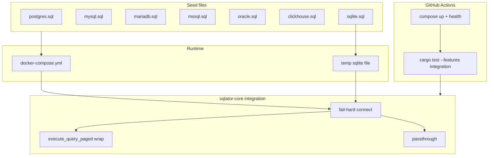

# Engine Test Databases - Plan

## Goal Capsule

- **Objective:** Prove pagination wrapping and passthrough against real engines using SQL-seeded test databases, and run those proofs in GitHub Actions (and locally with Docker required for the integration suite).
- **Authority:** This plan's Product Contract, then `core/src/db/sql_classify.rs` / `DbManager::execute_query_paged`, then `core/tests/group_c_integration.rs` for helpers to reuse — not copy-and-skip.
- **Out of scope for executors:** Product UI, new pagination features, driver bug-fixes unless a live wrapper is invalid SQL on an engine (then fix the wrapper, not paper over the test).
- **Stop:** Do not expand into schema-browser/connect smoke, SSH tunnel tests, or rewriting Group C skip-if-down behavior.
- **Execution profile:** Test-first live proofs. Seed and harness first so engines can answer queries; then add fail-hard tests; then wire CI.

## Product Contract

### Summary

Add per-engine seed SQL and a fail-hard live test suite that executes the query engine's WITH-clause pagination wrapper (and passthrough) against Postgres, MySQL, MariaDB, SQLite, MSSQL, Oracle, and ClickHouse. GitHub Actions starts the existing Compose databases and runs that suite. Everyday `cargo test` without the integration feature stays offline.

### Problem Frame

Classifier and wrapper construction are unit-tested as strings. SQLite Group C pins prove paging on one engine. Other engines are skip-if-down, there is no shared seed schema, and the repo has no GitHub workflow — so dialect page clauses (`LIMIT`/`OFFSET` vs `OFFSET … FETCH NEXT`, MSSQL nested-WITH passthrough) are not proven by CI.

### Requirements

**Seeds and engines**

- R1. Each Compose-backed engine has dialect-correct seed SQL that creates a small relational schema and enough rows to page (at least 1,250 rows in the paged table).
- R2. SQLite uses the same logical schema via a seed file applied in-test (file DB), not Docker.
- R3. Seeds are files on disk (not only inline Rust `format!` loops), so they can also initialize Compose on first start.

**Live query-engine tests**

- R4. Wrappable `SELECT` (and top-level `WITH` where the dialect allows) is executed through `execute_query_paged`; the engine must accept the generated wrapper SQL.
- R5. Page sequence, `has_more` sentinel, and server-side sort across page boundaries are asserted on every engine in R1/R2.
- R6. Non-wrappable SQL (DML/DDL/multi-statement, and MSSQL top-level `WITH`) runs as passthrough (`paged == false`) and still succeeds or fails the same way as `execute_query` for that statement class.
- R7. When the integration suite is enabled, a missing required engine is a **failure**, not a skip.

**CI and local Docker**

- R8. GitHub Actions starts Compose, waits until engines are ready, applies or relies on seeds, and runs the integration suite; a down engine fails the job.
- R9. The documented local path is the same: Docker Compose up, then the integration suite; it must fail if an engine is down.
- R10. `cargo test` / workspace tests **without** the `integration` feature remain runnable with no Docker (existing Group C skip gate stays).

### Success Criteria

- A GitHub Actions run on the default branch path executes live paged tests for all seven engine families (MariaDB counted with MySQL as a separate URL).
- A developer who has Compose up can reproduce a CI failure locally with the integration feature.
- Wrapper SQL that an engine rejects fails the suite on that engine.

### Scope Boundaries

**In**

- Seed SQL files, Compose init wiring, fail-hard live tests for wrap/passthrough, GitHub workflow.

**Out**

- GTK/TUI/web UI tests.
- Changing production pagination behavior except to make wrapper SQL valid on an engine.
- SSH / Group C characterization rewrite.

**Deferred to Follow-Up Work**

- Flip Group C tests from skip-if-down to fail-hard.
- Schema-browser / `get_schemas` smoke as a required matrix (MySQL VARBINARY pin already exists in Group C).
- Testcontainers as an alternative to Compose.

### Actors

- A1. Contributor running tests locally with Docker.
- A2. GitHub Actions runner.

### Key Flows

- F1. Seeded page wrap
  - **Trigger:** Integration suite runs against a reachable engine.
  - **Steps:** Connect with the Compose URL (or SQLite file); query the seeded table through `execute_query_paged`; assert page shape.
  - **Outcome:** Wrapper SQL is accepted; `paged` is true; row counts and `has_more` match.
- F2. CI gate
  - **Trigger:** Push or PR that touches the default CI paths.
  - **Steps:** Checkout; start Compose; wait healthy; `cargo test -p sqlator-core --features integration` (plus any new test binary names the implementer adds).
  - **Outcome:** Job red if any required engine is down or any live assertion fails.
- F3. Passthrough
  - **Trigger:** Integration suite sends non-wrappable SQL.
  - **Outcome:** `paged` is false; no `__sqlator_q` execution requirement; behavior matches unpaged path for that class.

### Acceptance Examples

- AE1. Covers R4, R5. Given 1,250 seeded rows, when page size 500 at offsets 0 / 500 / 1000, then row counts are 500, 500, 250 and `has_more` is true, true, false on Postgres and SQLite (same shape on every other required engine).
- AE2. Covers R6. Given MSSQL, when the user SQL is a top-level `WITH`, then the run is passthrough (`paged` false) and does not error solely because of wrapper nesting.
- AE3. Covers R7, R8. Given Compose Postgres stopped, when the integration suite runs, then the Postgres live test fails (does not skip).
- AE4. Covers R10. Given no Docker, when `cargo test -p sqlator-core` runs without `--features integration` and without `SQLATOR_INTEGRATION`, then the suite is green (Group C skips; new tests are gated the same way).

---

## Planning Contract

### Key Technical Decisions

- KTD-1. **Reuse `docker-compose.yml` URLs and ports.** Do not invent a second cluster. Wire seed files through each engine's init-directory convention (Postgres/MySQL/MariaDB `docker-entrypoint-initdb.d`; MSSQL/Oracle/ClickHouse use the engine's documented first-boot or a one-shot apply helper if init-dir is unreliable).
- KTD-2. **New integration file, not more skip-returns in Group C.** Put fail-hard live wrap/passthrough tests in `core/tests/` (e.g. `engine_paged.rs`). Reuse `collect_paged` / page-shape ideas from `core/tests/group_c_integration.rs`. Leave Group C skip-if-down as-is (R10 / deferred unify).
- KTD-3. **Gating matches today's feature/env, assertions do not.** Same enablement as Group C (`--features integration` or `SQLATOR_INTEGRATION=1`). Once enabled, `test_connection` failure is `assert`/`expect`, not `return`.
- KTD-4. **Per-dialect seed files.** Logical schema is shared (persons-like parent, orders-like child, `paged_items` with 1,250 integer rows). SQL syntax is per engine (identity/serial, quoting, types). SQLite seed is applied after connect.
- KTD-5. **GitHub Actions is new.** There is no existing workflow. Use a Linux job with Docker, `docker compose up -d`, health waits per service, then Cargo. Pin images already named in Compose (Postgres 17, MySQL 8.4, MariaDB 11, MSSQL 2022, Oracle Free, ClickHouse). Do not use Testcontainers in this plan.
- KTD-6. **Oracle and MSSQL boot time is a CI risk.** Healthchecks and job timeout must wait for actual accept-connection, not container start. If an image cannot run on the hosted runner (license, cgroup, memory), that is an implementation blocker to surface — do not silently drop the engine from CI.
- KTD-7. **MariaDB is a required URL**, same credentials/ports as Compose comments (`localhost:3337`).

### Assumptions

- Everyday `cargo test` without the integration feature remaining Docker-free satisfies "require Docker locally" together with the documented integration command (user confirmed Docker is required for the live suite, not that every default test invocation must start Compose).
- Seed-on-init only runs on empty data volumes. Tests must be idempotent (create-if-not-exists or a dedicated test database/schema) so a developer volume from prior `compose up` still works.
- Pure string tests in `sql_classify.rs` stay; this plan does not replace them.

### High-Level Technical Design



Wrapper anatomy (already implemented; tests must execute it, not re-specify it):

```text
WITH __sqlator_q AS ( <user sql> )
SELECT * FROM __sqlator_q [ORDER BY …] <LIMIT/OFFSET or OFFSET FETCH>
```

### Implementation Constraints

- Repo-relative paths only in docs; no secrets in workflow YAML (Compose passwords are already in-repo for local dev).
- Do not hold mutexes across `.await` in new async test helpers (`AGENTS.md`).
- Do not encode exact shell scripts in this plan beyond naming the Cargo package/feature CI must invoke.

### Sequencing

U1 seeds and Compose init → U2 harness fail-hard → U3 wrap matrix → U4 passthrough → U5 GitHub workflow (can start in parallel once U1–U3 names are stable).

---

## Implementation Units

### U1. Dialect seed SQL and Compose init

- **Goal:** Each engine can start with a queryable schema and 1,250+ paged rows from files.
- **Requirements:** R1, R2, R3
- **Dependencies:** none
- **Files:**
  - Create: `core/tests/fixtures/engines/postgres.sql` (and siblings `mysql.sql`, `mariadb.sql`, `mssql.sql`, `oracle.sql`, `clickhouse.sql`, `sqlite.sql`)
  - Modify: `docker-compose.yml` (bind-mount init dirs / equivalent first-boot apply)
- **Approach:** One logical schema: `paged_items(id, n)` with 1,250 rows, plus a small parent/child pair for ordinary `SELECT`/`JOIN` wrap cases. Dialects differ only in DDL/DML spelling. Prefer `INSERT … SELECT` generators where the engine allows, to keep files small. Compose mounts must not wipe existing named volumes unexpectedly — document that first boot applies seeds.
- **Execution note:** Prove a seed file by connecting with `DbManager` and `SELECT COUNT(*)` before writing the full matrix tests.
- **Patterns to follow:** Connection URLs in `docker-compose.yml` comments; Group C `seed_values_insert` row counts (1,250) and table shape (`id`, `n`).
- **Test scenarios:**
  - Happy path: After init, `SELECT COUNT(*) FROM paged_items` returns 1250 on SQLite via applied seed file.
  - Edge: Re-running the sqlite seed on an already-created schema does not fail the suite (idempotent or guarded).
  - Error: A seed with invalid dialect SQL fails at apply time (visible in Compose logs or test apply), not later as a confusing empty table.
- **Verification:** Compose-first-boot or test apply leaves `paged_items` queryable on at least SQLite and Postgres.

### U2. Fail-hard integration harness

- **Goal:** Shared connect + event collection that fails when an enabled engine is down.
- **Requirements:** R7, R9, R10
- **Dependencies:** U1
- **Files:**
  - Create: `core/tests/engine_paged.rs` (harness + enablement)
  - Modify: `core/Cargo.toml` only if extra `include`/`[[test]]` is required (prefer default `tests/*.rs`)
- **Approach:** Same enablement as Group C. When disabled, tests return immediately. When enabled, each engine helper `expect`s `test_connection` and `connect`. Factor `collect_paged` rather than duplicating channel capacity comments.
- **Execution note:** Add a single failing "postgres must be up" test first, then the rest of the matrix.
- **Patterns to follow:** `core/tests/group_c_integration.rs` URLs, `integration_enabled`, `collect_paged`, `assert_page_shape` — change skip to fail.
- **Test scenarios:**
  - Happy path: With Compose up and feature on, harness connects to Postgres at `localhost:5454`.
  - Edge: Feature off → tests are silent skips (no failure).
  - Error: Feature on, Postgres down → test fails.
  - Integration: SQLite harness never requires Compose.
- **Verification:** `cargo test -p sqlator-core` green offline; `cargo test -p sqlator-core --features integration` red if Postgres is down.

### U3. Live wrap matrix for pagination

- **Goal:** Every engine accepts wrapper SQL and matches page/`has_more`/sort pins.
- **Requirements:** R4, R5, AE1
- **Dependencies:** U1, U2
- **Files:**
  - Modify: `core/tests/engine_paged.rs`
  - Test: `core/tests/engine_paged.rs`
- **Approach:** Parameterize engines (URL + dialect expectations). User SQL: `SELECT id, n FROM paged_items` and one top-level `WITH` (skip wrap assertion on MSSQL — that is U4). Reuse 500-row pages and offsets 0/500/1000. Sort `id DESC` across pages. Assert `outcome.paged == true` except the MSSQL WITH case.
- **Patterns to follow:** Group C `paged_sqlite_pages_of_500_sequence_and_has_more` and `paged_sqlite_sort_spec_orders_across_page_boundaries`.
- **Test scenarios:**
  - Happy path: Postgres wrap of plain SELECT; three offsets; AE1 counts.
  - Happy path: Same on MySQL, MariaDB, SQLite, ClickHouse, Oracle, MSSQL (plain SELECT).
  - Happy path: Top-level WITH wrap on non-MSSQL engines.
  - Edge: Empty filter `WHERE 1=0` — `paged` true, zero rows, `has_more` false (match SQLite Group C empty-page Columns behavior or document engine differences if a driver emits Columns).
  - Error: Wrapper rejected by the engine → test fails with the driver error (do not catch-and-skip).
  - Integration: Server-side sort `id DESC` concatenates to `1250..=1`.
- **Verification:** Integration feature + Compose: wrap tests pass on all required URLs.

### U4. Live passthrough pins

- **Goal:** Non-wrappable SQL does not go through `__sqlator_q` and still runs via the paged entrypoint.
- **Requirements:** R6, AE2
- **Dependencies:** U2, U1
- **Files:**
  - Modify: `core/tests/engine_paged.rs`
- **Approach:** Call `execute_query_paged` with DML (`UPDATE`/`INSERT` that is safe on seed data or a scratch table), and MSSQL top-level WITH. Assert `paged == false`. Compare event shape to `execute_query` where that is cheap (duration stripped, as Group C `without_durations`).
- **Patterns to follow:** Group C passthrough equivalence comments; `PassthroughReason` tags in `sql_classify.rs`.
- **Test scenarios:**
  - Happy path: `CREATE TABLE` / scratch DML through `execute_query_paged` → `paged` false, object exists.
  - Happy path: MSSQL top-level WITH → `paged` false, rows still returned (AE2).
  - Edge: Multi-statement buffer → passthrough (or engine error); must not wrap only the first statement inside a CTE.
  - Error: Invalid SQL passthrough still surfaces `QueryEvent::Error` (or `Err`) rather than a silent empty page with `paged` true.
- **Verification:** MSSQL WITH and at least one DML passthrough pass live.

### U5. GitHub Actions integration job

- **Goal:** CI starts Compose, waits for engines, runs the integration suite; job fails if an engine is down.
- **Requirements:** R8, R9, AE3
- **Dependencies:** U1, U2, U3 (U4 should be included in the same cargo invocation once present)
- **Files:**
  - Create: `.github/workflows/core-integration.yml` (name may vary; one workflow is enough)
  - Modify: `README.md` (short "CI / integration tests" pointer — Docker required for that path)
- **Approach:** `ubuntu-latest`, checkout, stable Rust, Docker Compose plugin, `docker compose up -d` for database services (OpenSSH optional; not required for this plan). Wait until each DB port accepts connections (or Compose healthcheck). Then `cargo test -p sqlator-core --features integration`. Set a job timeout that covers Oracle/MSSQL pull + boot. Cache `target/` if it does not fight SQLX offline quirks; if cache is flaky, skip cache rather than greenwashing skips.
- **Execution note:** This is packaging/config; prove with a workflow run on a branch, not with unit tests of YAML.
- **Patterns to follow:** Compose service names and host ports already used by Group C.
- **Test expectation:** none — workflow YAML. Completeness is a red job when Postgres is not healthy and a green job when U3/U4 pass on the runner.
- **Verification:** Workflow file exists; README documents Docker + `--features integration`; a dry-run or first CI run shows services healthy before tests.

---

## Verification Contract

| Gate | When | Done signal |
|------|------|-------------|
| Offline unit | Every PR that does not claim live engines | `cargo test -p sqlator-core` without integration feature is green |
| Live wrap/passthrough | After U3/U4; local Docker required | `cargo test -p sqlator-core --features integration` green with Compose up; red if a required engine is down |
| CI | After U5 | GitHub Actions job runs the live suite; AE3-class failure if a service is down |
| Lint | If Rust changed | Workspace clippy lints still deny `await_holding_lock` |

Exact flags belong in README/workflow, not as a second source of truth here.

## Definition of Done

- R1–R10 are met; AE1–AE4 are demonstrated by tests or CI behavior.
- U1–U5 landed; abandoned experimental seed variants are deleted.
- Group C still skip-if-down; default cargo test still Docker-free.
- README mentions the integration path.

## System-Wide Impact

- **CI:** First GitHub Actions workflow; runner minutes and image pulls (Oracle/MSSQL are heavy).
- **Dev volumes:** Init-db mounts only affect empty volumes; existing `pgdata` etc. will not re-seed — tests must tolerate that or document `docker compose down -v`.
- **Agents/frontends:** No GTK/Tauri change.

## Risks & Dependencies

| Risk | Mitigation |
|------|------------|
| Oracle/MSSQL images fail on GitHub hosted runners | Health wait + timeout; if blocked, stop and report — do not skip in CI |
| Named volumes hide missing seeds | Idempotent apply in tests or a dedicated `sqlator_test` schema created by the test |
| Duplicate tests vs Group C SQLite pins | New file owns the multi-engine matrix; do not delete Group C in this plan |
| Workflow secrets unused; passwords in Compose | Accept as local-dev parity; do not put production credentials in CI |

## Sources & Research

- `core/src/db/sql_classify.rs` — `wrap_for_pagination`, MSSQL `MssqlTopLevelWith`, dialect page clauses.
- `core/src/db/mod.rs` — `DatabaseType`, `PAGED_ROW_CEILING`, `execute_query_paged`.
- `core/tests/group_c_integration.rs` — URLs, gating, SQLite page pins, `collect_paged`.
- `docker-compose.yml` — engines, ports, credentials.
- `docs/plans/gtk/2026-08-14-001-feat-gtk-grid-infinite-scroll-plan.md` — original wrap design.
- No existing `.github/workflows`; CI is greenfield.
- Slack was not searched (no Slack tools in this session).
