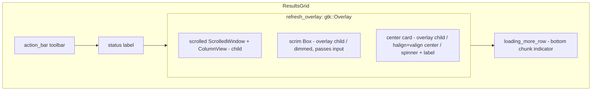
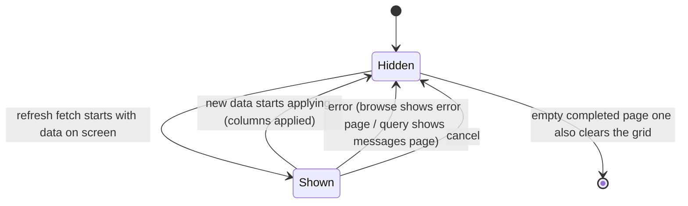

# GTK Grid Refresh Loading Overlay - Plan

## Goal Capsule

- **Objective:** Replace the "Updating…" text indicator shown while a data grid refreshes with a dimmed overlay over the grid plus a centered floating card (spinner + loading text), delivered once on the shared `ResultsGrid` so the schema browse tab and the query tab behave identically.
- **Authority hierarchy:** the user's request governs behavior (both grids identical; refresh-only — first load unchanged); the shipped infinite-scroll plan's indicator boundaries govern coexistence; existing repo conventions (workspace lints, GTK patterns, testing conventions) govern code shape.
- **Stop conditions:** a change to first-load experiences, append chunk-indicator behavior, edit/sort guards, or query execution semantics; any required change outside the `gtk/` crate — surface, don't guess.
- **Execution profile:** three units, U1 → {U2, U3 in either order}. Single-PR friendly.
- **Tail ownership:** the implementer runs the Verification Contract gates, satisfies per-unit test scenarios, and removes abandoned-approach code before declaring done.

---

## Product Contract

### Summary

When a results grid refreshes with data already on screen (sort change, filter change, re-run, reconnect reload), the GTK app covers the grid with a dimmed overlay and a centered floating card holding a spinner and loading text. The affordance is built once on the shared `ResultsGrid` so the browse tab and query tab behave the same; first load and scroll-append indicators stay as they are.

### Problem Frame

The schema browse tab signals a refresh with a tiny dimmed caption reading "Updating…" above the grid — easy to miss while the user waits on a filter or sort change. The query tab is worse: a re-run or sort re-query clears the grid up front, leaving an empty pane whose only signal is a spinner in the tab strip. The two surfaces disagree with each other and neither communicates "your data is being replaced" well. The infinite-scroll work (`docs/plans/2026-08-14-001-feat-gtk-grid-infinite-scroll-plan.md`, now shipped) settled the other two loading affordances — first-load pages and the bottom chunk indicator — but left the refresh indicator as a trigger-swap leftover.

### Requirements

Refresh overlay:

- R1. While a browse-tab refresh fetch (sort, filter add/remove, clear filters, reconnect/preference reload) is in flight with data on screen, the grid shows a dimmed overlay over the data area with a centered floating card (spinner + "Loading data…"); the "Updating…" caption and its label widget are removed.
- R2. The query tab shows the identical overlay for its refresh cases — manual re-run and sort-change re-query when results are on screen; the stale rows stay visible, dimmed, under the overlay until new data starts applying.

Unchanged neighbors:

- R3. First-load experiences are untouched: browse keeps its centered "Loading data…" stack page, and a query tab's first run behaves as today (empty grid, streaming rows, tab-strip spinner).
- R4. Scroll-append chunk fetches keep the grid's bottom `loading_more_row` indicator; the overlay never shows for appends, and the two indicators stay independent (neither implies the other).
- R5. Loading labels outside the results grids (schema tree "Loading tables…", DDL tab, connection/SSH/docker dialogs, window schema banner) are untouched.

Edge behavior:

- R6. The overlay hides when new data starts applying, on error, and on cancel; a page-one result with zero rows still clears the previously displayed rows at completion, so no stale data survives a completed refresh.
- R7. Canceling a query-tab refresh leaves the previously loaded results on screen (today the grid is already cleared, so a cancel shows an empty pane).

### Scope Bounds

- **Out of scope:** interaction lockout during refresh. Pointer input behavior stays as today; the overlay is a visual affordance, not a modal.
- **Out of scope:** edit/sort semantics — sort-with-pending-edits stays refused with a toast (scroll plan R8), manual re-run still resets edit state, chunk/page state machines are untouched.
- **Out of scope:** the Tauri/Svelte, TUI, and web frontends, and the engine (`core/`, `service/`). The workspace build gate proves they compile unchanged.
- **Out of scope:** the append chunk indicator's appearance (bottom row stays the plain spinner + caption from the scroll plan).

#### Deferred to Follow-Up Work

- Reconciling the crate's spinner type with the parity plan's stated `AdwSpinner` convention; all three current spinner sites are `gtk::Spinner`, and this plan's overlay card matches them for visual consistency (see KTD-2).

---

## High-Level Technical Design

Two shapes carry the design: where the overlay sits in the grid's widget tree, and the show/hide lifecycle.

### Widget placement (shared `ResultsGrid`)

The `gtk::Overlay` wraps the existing `scrolled` at its single insertion point in `imp::new()`; the toolbar, status label, and chunk indicator stay outside the dimmed region. Directional, not implementation specification: names and the exact insertion point follow the existing build in `gtk/src/results/grid.rs`.

### Refresh lifecycle (both tabs)

Show/hide happens only on the glib side of the existing generation-guarded async bridges; a superseded generation never toggles the overlay.

---

## Planning Contract

### Key Technical Decisions

- **KTD-1. The overlay lives on `ResultsGrid` as a `gtk::Overlay` around the scrolled grid area.** `imp::new()` wraps `scrolled` in the overlay at the point where `root.append(&scrolled)` happens today, keeping `action_bar`, `status`, and `loading_more_row` as un-dimmed siblings. The widget exposes `set_refreshing(bool)` beside the scroll plan's `set_loading_more(bool)`; the two affordances are independent by construction. Rationale: both tabs must behave identically, and the scroll plan already established the grid as the shared home for grid loading affordances (its KTD-6/KTD-9 pattern). The scrim dims the data area only — the status text and bottom indicator remain legible during a refresh.
- **KTD-2. One new scrim CSS class; the card reuses existing shapes.** `gtk/data/style.css` gains a scrim class with a theme-color alpha background (the `alpha(@borders, 0.35)` precedent in that file); the card uses Adwaita's built-in `.card` class with a `gtk::Spinner` plus a dimmed "Loading data…" label, mirroring `loading_more_row`. Rationale: `.dimmed`'s `opacity: 0.7` alone can't scrim a region, and blur/backdrop effects add GSK cost over the ColumnView (the per-widget budget the ColumnView spike flagged). `gtk::Spinner` is a deliberate choice: all three current spinner sites use it, visual identity between the overlay card and the sibling chunk indicator wins over the parity plan's un-landed `AdwSpinner` note, and reconciling the convention crate-wide is deferred (see Scope Bounds).
- **KTD-3. Query tab defers the destructive clear to page-one application.** Today `launch_page_one` calls `clear_results()` up front; for a refresh (grid has rows) it instead shows the overlay and keeps the rows. The messages buffer still clears at run start; edit state still resets and the edit overlay still clears (re-run semantics unchanged); the grid's data is replaced by the incoming `Columns`/`begin_columns` application exactly as the browse tab's `apply_result` replaces it. A non-chunk `Done` that arrived with no `Columns` event (empty result) clears the grid at completion, matching today's empty-grid outcome. Chunk fetches are canceled by a page-one launch as today, so overlay and `loading_more_row` never coexist on the query tab.
- **KTD-4. Show/hide wiring uses the existing generation-guarded bridges only.** Browse toggles inside `fetch()` and its completion future; the query tab toggles in `launch_page_one` and the page-one event/completion handling, replacing the `TabPage:loading`-only signal for the in-view refresh case (the tab-strip spinner itself stays — R3). No new async plumbing; a stale generation never touches the overlay (the `await_holding_lock` class of issues does not apply — visibility toggles are synchronous glib calls).
- **KTD-5. The overlay is visual, not modal.** The scrim passes pointer input through (today's behavior: users can scroll and edit filters mid-refresh; fetch paths are already guarded at the callback level); the centered card swallows its own clicks with a no-op gesture so a click on the card can't fall through to cell activation. Rationale: adding a lockout would change behavior beyond the requested indicator swap.

### Implementation Constraints

- Workspace lints apply: `unused_must_use = deny` (gtk-rs `Result`s must be handled), `clippy::await_holding_lock` and `rc_buffer` denied. The overlay adds no async code.
- `gtk/src/widget_smoke.rs` is a single shared `#[serial]` test — new assertions are added to it, never a second `#[test]` (GTK's single-main-thread constraint, already documented in that file).
- No new dependencies; `gtk::Overlay` is stock GTK4.

---

## Implementation Units

### U1. ResultsGrid refresh-overlay affordance

- **Goal:** `ResultsGrid` owns a dimming overlay with a centered spinner card over its data area, hidden by default, toggled via `set_refreshing(bool)`.
- **Requirements:** R1 (affordance half), R2 (affordance half), R4's independence condition.
- **Dependencies:** none.
- **Files:**
  - `gtk/src/results/grid.rs` — overlay widget, scrim + card children, `set_refreshing`
  - `gtk/data/style.css` — scrim CSS class
  - `gtk/src/widget_smoke.rs` — smoke assertions for the new affordance
- **Approach:** Wrap `scrolled` in a `gtk::Overlay` at its existing insertion point in `imp::new()` (KTD-1). Overlay children: a full-area scrim `gtk::Box` carrying the new CSS class (KTD-2), and a centered card `gtk::Box` (`.card` class, halign/valign center) containing `gtk::Spinner` (spinning at build time, matching `loading_more_row`) plus a dimmed "Loading data…" label. Both overlay children start hidden and follow a single `refresh_visible` state — mirror `loading_more_row`'s hidden-by-default + toggle shape. The card gets a no-op `GestureClick` so it swallows clicks (KTD-5); the scrim gets no controllers. Keep the affordance structure-assertable on imp fields the way `loading_more_row` is.
- **Patterns to follow:** `loading_more_row` construction and hidden-default shape (`gtk/src/results/grid.rs`); browse stack "loading" spinner + "Loading data…" caption (`gtk/src/schema/browse.rs`); alpha-theme-color CSS precedent and class naming (`gtk/data/style.css`); widget-smoke assertions for `loading_more_row` (`gtk/src/widget_smoke.rs`).
- **Test scenarios:**
  - Widget smoke: `refresh_overlay` exists in the widget tree; scrim and card are hidden by default.
  - Widget smoke: `set_refreshing(true)` shows scrim and card, `set_refreshing(false)` hides both.
  - Widget smoke: `set_refreshing(true)` + `set_loading_more(true)` can be toggled independently — setting one does not change the other's visibility (R4).
  - Widget smoke: all pre-existing `ResultsGrid` pins (status text, `loading_more_row`, edit toolbar) still pass unchanged.
- **Verification:** `./gtk/scripts/run-tests-headless.sh` green with the new assertions; `cargo clippy --workspace --all-targets` clean.

### U2. Browse tab switches refresh signaling to the overlay

- **Goal:** The browse tab's refresh branch shows the grid overlay, and the "Updating…" caption machinery is gone.
- **Requirements:** R1, R4, R6.
- **Dependencies:** U1.
- **Files:**
  - `gtk/src/schema/browse.rs` — indicator branching in `fetch()`/completion, remove `inline_status`
  - `gtk/src/widget_smoke.rs` — update browse-tab assertions if any reference the removed label
- **Approach:** `fetch()` currently branches three ways: append → `set_loading_more(true)`, no result → stack "loading" page, else → the `inline_status` caption. Replace the third branch with `grid.set_refreshing(true)`; the first two are untouched (R3, R4). The completion future hides the overlay where it hides the caption today — on success and on the error path (stack "error"), inside the generation guard (KTD-4). Delete the `inline_status` field, builder block, `root.append`, and all remaining references. The error path still swaps to the "error" stack page, so the overlay hiding there is belt-and-braces — keep it explicit so a Retry that re-enters the overlay branch can't inherit a stuck overlay.
- **Patterns to follow:** the existing three-way branch and generation-guarded completion in `gtk/src/schema/browse.rs` `fetch()`; KTD-9's toggle-in-glib-callback precedent from the scroll plan.
- **Test scenarios:**
  - Compile-time proof: no reference to `inline_status` or "Updating…" remains (`rg` clean) after the widget and its uses are removed.
  - Widget smoke / headless assertions: existing browse-tab tests (`should_fetch_more` suite, browse construction assertions) pass unchanged.
  - Integration scenario (manual smoke): with rows on screen — add a filter, change a filter value (debounced fetch), clear filters, and change column sort each show the overlay over dimmed rows and hide it when new data lands.
  - Error path (manual smoke): force a query failure during a refresh (e.g., kill the connection) — overlay hides, the "error" stack page shows; Retry from it returns to results.
  - Reconnect/preference reload path (`reload()` from window) shows the same overlay rather than any text caption.
  - Negative (manual smoke): scroll-append shows only the bottom indicator; the first-ever load shows only the stack "loading" page — the overlay appears in neither.
- **Verification:** `./gtk/scripts/run-tests-headless.sh` green; manual smoke against any live or SQLite database covers the branching scenarios above.

### U3. Query tab refresh keeps data under the overlay

- **Goal:** A manual re-run or sort re-query with results on screen keeps the stale rows visible under the overlay until new data starts applying, instead of clearing to an empty grid up front.
- **Requirements:** R2, R4, R6, R7.
- **Dependencies:** U1.
- **Files:**
  - `gtk/src/query_tab/mod.rs` — `launch_page_one` refresh branch, page-one event/completion handling
- **Approach:** `launch_page_one` currently calls `clear_results()` unconditionally after `set_busy(true)`. Split the two effects: the messages buffer still clears at run start (message semantics are run-scoped), while the grid clears up front only when it has no rows (first run, passthrough shapes — R3 keeps today's look); when the grid has rows, show `set_refreshing(true)` and proceed. Edit-state reset and edit-overlay clearing stay at run start (re-run semantics unchanged; the displayed rows are raw results, not edit state). In `handle_event`, a non-chunk `Columns` is the first destructive step — hide the overlay there, matching browse's apply-time hide; a non-chunk `Done` with no `Columns` seen for this run clears the grid and then hides the overlay (R6); `Error` and the cancel/completion path hide the overlay without touching rows (R7). The generation guard already prevents a superseded run from touching widget state; a newer run re-shows the overlay if rows remain, so consecutive refreshes end with the overlay hidden exactly once — assert that in smoke.
- **Execution note:** this is the unit most likely to expose an untested edge during integration; verify the R6/R7 edge paths manually before declaring done even if the smoke suite is green.
- **Patterns to follow:** `launch_page_one` / `handle_event` structure as it stands after the scroll plan (`gtk/src/query_tab/mod.rs`); browse's apply-result-as-swap-point precedent (U2); KTD-9's chunk vs page-one affordance split.
- **Test scenarios:**
  - Integration (manual smoke): re-run a SELECT with results on screen — rows dim under the overlay, overlay hides as new columns/rows land, status updates to the new result.
  - Integration (manual smoke): change column sort on a paged result — same overlay behavior, re-queried order, no full-grid flash.
  - Guard behavior: column sort with unsaved cell edits — refusal toast, no overlay, grid untouched (scroll plan R8 pin, should already hold).
  - Empty result: run a SELECT matching zero rows over previous results — overlay hides at completion and the grid is empty with the zero-row status (R6).
  - Error: re-run against a broken connection — overlay hides, messages page shows the error, and flipping back to results shows the previous rows were left intact (R7-adjacent).
  - Cancel: re-run then cancel before completion — overlay hides and the previous rows remain (R7).
  - Independence: trigger a chunk append (bottom indicator), then re-run mid-append — the chunk is canceled, the bottom indicator is gone, and exactly the overlay shows until page one applies.
  - Consecutive refreshes: launch two re-runs back-to-back — the final state has the overlay hidden and the newest rows shown exactly once (generation guard).
  - Existing headless `cargo test -p sqlator-gtk` suites (`paging.rs`, `paging_helpers.rs`, `widget_smoke.rs`) stay green — no state-machine regressions.
- **Verification:** `./gtk/scripts/run-tests-headless.sh` green plus the manual edge scenarios above; `cargo build --workspace` proves no other frontend is touched.

---

## Verification Contract

| Gate | Command | Applies to |
|---|---|---|
| GTK unit + widget smoke | `./gtk/scripts/run-tests-headless.sh` (xvfb + dbus; `cargo test -p sqlator-gtk` single-threaded) | U1, U2, U3 |
| Workspace compile + lint | `cargo build --workspace` and `cargo clippy --workspace --all-targets` (workspace lints deny `await_holding_lock`, `rc_buffer`, `unused_must_use`) | all — proves Tauri/TUI/web compile unchanged |
| Manual behavior smoke | GTK app against any database: browse refresh (filter/sort) shows overlay; query re-run and sort re-query keep dimmed rows under the overlay; first load and append indicators unchanged; error/cancel/empty-result edges per U2/U3 scenarios | U1–U3 |

---

## Definition of Done

Global:

- All Verification Contract gates pass.
- Refreshing with data on screen shows the dimmed overlay and centered spinner card in both the browse tab and the query tab; the string "Updating…" no longer exists in the crate.
- First load, scroll-append, tab-strip spinner, and all non-grid loading labels behave exactly as before.
- No abandoned-approach code remains in the diff (alternative indicator shapes, commented-out caption wiring, debug tracing).

Per unit:

- U1 done when the overlay, scrim, and card exist on `ResultsGrid`, are hidden by default, and the smoke toggling assertions pass.
- U2 done when browse refresh shows only the overlay, the caption machinery is fully removed, and its filter/sort/retry/reload/reconnect scenarios hold.
- U3 done when query-tab refresh keeps rows under the overlay and its empty/error/cancel/independence/consecutive-refresh scenarios hold.

---

## Risks & Dependencies

| Risk | Mitigation |
|---|---|
| Empty page-one leaves stale rows visible (a zero-row result emits no `Columns` event today) | R6 + U3 approach: non-chunk `Done` without a seen `Columns` clears the grid at completion; manual scenario pins it |
| Scrim looks wrong in dark vs light themes | Theme-color alpha background (KTD-2) tracks the theme; both modes checked in manual smoke |
| Overlay and chunk indicator double-show | Query tab: page-one launch cancels chunk fetches first (existing behavior) and the state machine separates them; browse: append vs refresh branches are mutually exclusive; U1 smoke asserts toggle independence |
| Parity plan prefers `AdwSpinner` while the card uses `gtk::Spinner` | Deliberate KTD-2 choice (sibling consistency); crate-wide reconciliation deferred explicitly |

Dependencies: the shipped infinite-scroll baseline (`connect_near_bottom`, `loading_more_row`, `QueryPaging`, server-side sort) — present in-tree; no new crates.

---

## Sources & Research

- Behavioral predecessor (load-bearing): `docs/plans/2026-08-14-001-feat-gtk-grid-infinite-scroll-plan.md` — KTD-6/KTD-9 define the affordance boundary this plan respects: chunk fetches signal only via the bottom indicator, never the tab spinner; refresh is the tab-spinner domain the overlay now joins (U2/U3), and its U4 left the "Updating…" caption untouched by design.
- Widget-smoke conventions (single shared `#[serial]` test, assert structure not synthesized input, `GSETTINGS_SCHEMA_DIR` requirement): `docs/plans/gtk/2026-07-25-006-chore-gtk-testing-and-tooling-plan.md`, realized in `gtk/src/widget_smoke.rs` and `gtk/scripts/run-tests-headless.sh`.
- Spinner-type convention conflict (parity plan says `AdwSpinner`, all shipped sites use `gtk::Spinner`): `docs/plans/gtk/2026-07-25-004-feat-gtk-parity-buildout-plan.md` vs `gtk/src/schema/browse.rs`, `gtk/src/schema/ddl.rs`, `gtk/src/results/grid.rs` — resolved in KTD-2.
- ColumnView per-widget performance budget (keep the overlay cheap, no blur/backdrop): `docs/plans/gtk/2026-07-25-001-spike-columnview-results-grid-plan.md`.
- Current indicator sites being replaced or built on: `gtk/src/schema/browse.rs` (`fetch()` indicator branch, `inline_status`), `gtk/src/query_tab/mod.rs` (`set_busy`, `launch_page_one`, `handle_event`), `gtk/src/results/grid.rs` (`scrolled` insertion point, `loading_more_row`, `set_loading_more`).
